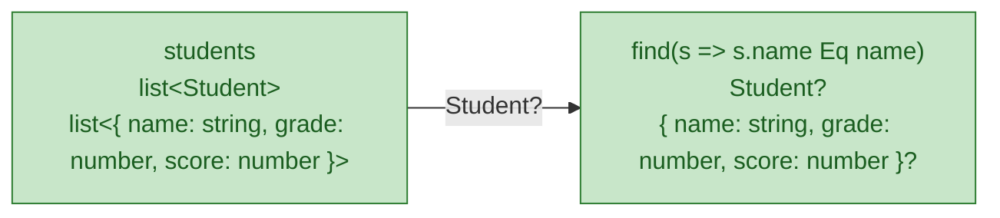
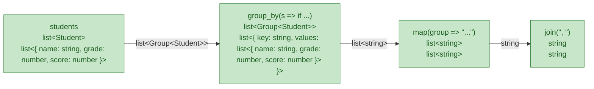
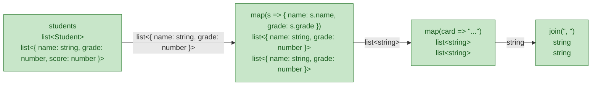
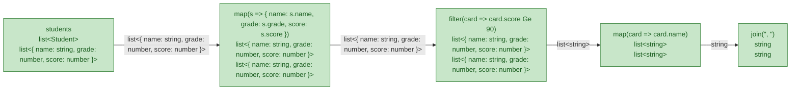
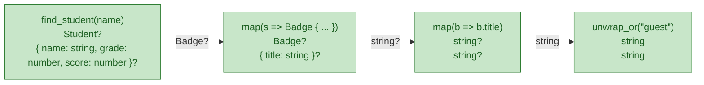
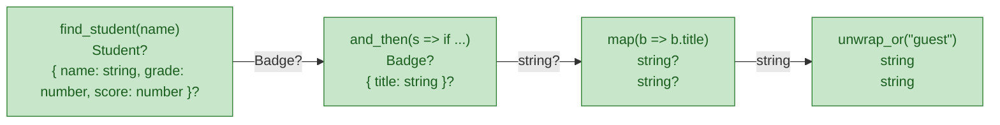
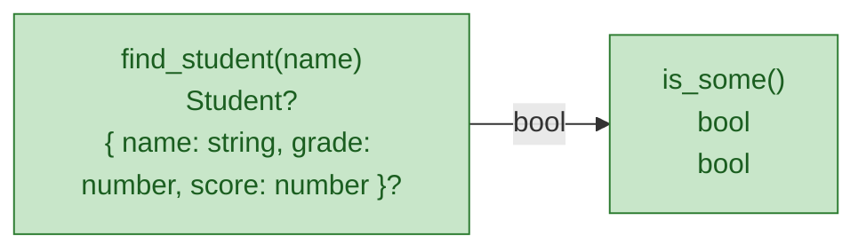
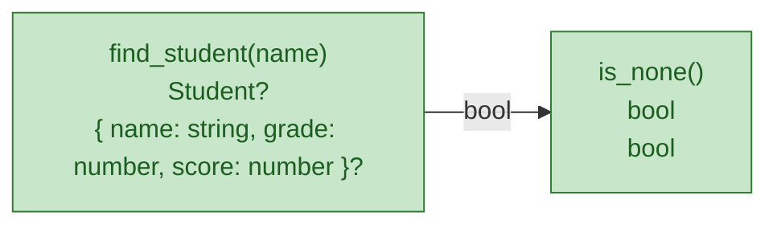
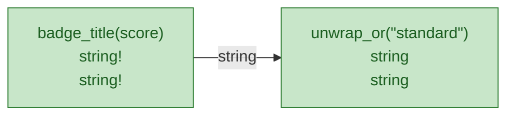
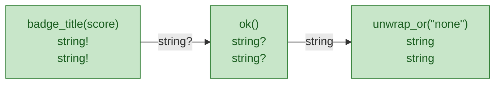

```mermaid
flowchart LR
    N1["students
list&lt;Student&gt;
list&lt;{ name: string, grade: number, score: number }&gt;"]:::ok
    N2["find(s =&gt; s.name Eq name)
Student?
{ name: string, grade: number, score: number }?"]:::ok
    N1 -->|"Student?"| N2
    classDef ok fill:#c8e6c9,stroke:#2e7d32,color:#1b5e20
    classDef warning fill:#fff3cd,stroke:#f9a825,color:#795548
    classDef error fill:#f88,stroke:#b71c1c,color:#7f0000
    classDef unknown fill:#eceff1,stroke:#607d8b,color:#263238
```

```mermaid
flowchart LR
    N1["students
list&lt;Student&gt;
list&lt;{ name: string, grade: number, score: number }&gt;"]:::ok
    N2["group_by(s =&gt; if ...)
list&lt;Group&lt;Student&gt;&gt;
list&lt;{ key: string, values: list&lt;{ name: string, grade: number, score: number }&gt; }&gt;"]:::ok
    N3["map(group =&gt; &quot;...&quot;)
list&lt;string&gt;
list&lt;string&gt;"]:::ok
    N4["join(&quot;, &quot;)
string
string"]:::ok
    N1 -->|"list&lt;Group&lt;Student&gt;&gt;"| N2
    N2 -->|"list&lt;string&gt;"| N3
    N3 -->|"string"| N4
    classDef ok fill:#c8e6c9,stroke:#2e7d32,color:#1b5e20
    classDef warning fill:#fff3cd,stroke:#f9a825,color:#795548
    classDef error fill:#f88,stroke:#b71c1c,color:#7f0000
    classDef unknown fill:#eceff1,stroke:#607d8b,color:#263238
```

```mermaid
flowchart LR
    N1["students
list&lt;Student&gt;
list&lt;{ name: string, grade: number, score: number }&gt;"]:::ok
    N2["map(s =&gt; { name: s.name, grade: s.grade })
list&lt;{ name: string, grade: number }&gt;
list&lt;{ name: string, grade: number }&gt;"]:::ok
    N3["map(card =&gt; &quot;...&quot;)
list&lt;string&gt;
list&lt;string&gt;"]:::ok
    N4["join(&quot;, &quot;)
string
string"]:::ok
    N1 -->|"list&lt;{ name: string, grade: number }&gt;"| N2
    N2 -->|"list&lt;string&gt;"| N3
    N3 -->|"string"| N4
    classDef ok fill:#c8e6c9,stroke:#2e7d32,color:#1b5e20
    classDef warning fill:#fff3cd,stroke:#f9a825,color:#795548
    classDef error fill:#f88,stroke:#b71c1c,color:#7f0000
    classDef unknown fill:#eceff1,stroke:#607d8b,color:#263238
```

```mermaid
flowchart LR
    N1["students
list&lt;Student&gt;
list&lt;{ name: string, grade: number, score: number }&gt;"]:::ok
    N2["map(s =&gt; { name: s.name, grade: s.grade, score: s.score })
list&lt;{ name: string, grade: number, score: number }&gt;
list&lt;{ name: string, grade: number, score: number }&gt;"]:::ok
    N3["filter(card =&gt; card.score Ge 90)
list&lt;{ name: string, grade: number, score: number }&gt;
list&lt;{ name: string, grade: number, score: number }&gt;"]:::ok
    N4["map(card =&gt; card.name)
list&lt;string&gt;
list&lt;string&gt;"]:::ok
    N5["join(&quot;, &quot;)
string
string"]:::ok
    N1 -->|"list&lt;{ name: string, grade: number, score: number }&gt;"| N2
    N2 -->|"list&lt;{ name: string, grade: number, score: number }&gt;"| N3
    N3 -->|"list&lt;string&gt;"| N4
    N4 -->|"string"| N5
    classDef ok fill:#c8e6c9,stroke:#2e7d32,color:#1b5e20
    classDef warning fill:#fff3cd,stroke:#f9a825,color:#795548
    classDef error fill:#f88,stroke:#b71c1c,color:#7f0000
    classDef unknown fill:#eceff1,stroke:#607d8b,color:#263238
```

```mermaid
flowchart LR
    N1["find_student(name)
Student?
{ name: string, grade: number, score: number }?"]:::ok
    N2["map(s =&gt; Badge { ... })
Badge?
{ title: string }?"]:::ok
    N3["map(b =&gt; b.title)
string?
string?"]:::ok
    N4["unwrap_or(&quot;guest&quot;)
string
string"]:::ok
    N1 -->|"Badge?"| N2
    N2 -->|"string?"| N3
    N3 -->|"string"| N4
    classDef ok fill:#c8e6c9,stroke:#2e7d32,color:#1b5e20
    classDef warning fill:#fff3cd,stroke:#f9a825,color:#795548
    classDef error fill:#f88,stroke:#b71c1c,color:#7f0000
    classDef unknown fill:#eceff1,stroke:#607d8b,color:#263238
```

```mermaid
flowchart LR
    N1["find_student(name)
Student?
{ name: string, grade: number, score: number }?"]:::ok
    N2["and_then(s =&gt; if ...)
Badge?
{ title: string }?"]:::ok
    N3["map(b =&gt; b.title)
string?
string?"]:::ok
    N4["unwrap_or(&quot;guest&quot;)
string
string"]:::ok
    N1 -->|"Badge?"| N2
    N2 -->|"string?"| N3
    N3 -->|"string"| N4
    classDef ok fill:#c8e6c9,stroke:#2e7d32,color:#1b5e20
    classDef warning fill:#fff3cd,stroke:#f9a825,color:#795548
    classDef error fill:#f88,stroke:#b71c1c,color:#7f0000
    classDef unknown fill:#eceff1,stroke:#607d8b,color:#263238
```

```mermaid
flowchart LR
    N1["find_student(name)
Student?
{ name: string, grade: number, score: number }?"]:::ok
    N2["is_some()
bool
bool"]:::ok
    N1 -->|"bool"| N2
    classDef ok fill:#c8e6c9,stroke:#2e7d32,color:#1b5e20
    classDef warning fill:#fff3cd,stroke:#f9a825,color:#795548
    classDef error fill:#f88,stroke:#b71c1c,color:#7f0000
    classDef unknown fill:#eceff1,stroke:#607d8b,color:#263238
```

```mermaid
flowchart LR
    N1["find_student(name)
Student?
{ name: string, grade: number, score: number }?"]:::ok
    N2["is_none()
bool
bool"]:::ok
    N1 -->|"bool"| N2
    classDef ok fill:#c8e6c9,stroke:#2e7d32,color:#1b5e20
    classDef warning fill:#fff3cd,stroke:#f9a825,color:#795548
    classDef error fill:#f88,stroke:#b71c1c,color:#7f0000
    classDef unknown fill:#eceff1,stroke:#607d8b,color:#263238
```

```mermaid
flowchart LR
    N1["badge_title(score)
string!
string!"]:::ok
    N2["unwrap_or(&quot;standard&quot;)
string
string"]:::ok
    N1 -->|"string"| N2
    classDef ok fill:#c8e6c9,stroke:#2e7d32,color:#1b5e20
    classDef warning fill:#fff3cd,stroke:#f9a825,color:#795548
    classDef error fill:#f88,stroke:#b71c1c,color:#7f0000
    classDef unknown fill:#eceff1,stroke:#607d8b,color:#263238
```

```mermaid
flowchart LR
    N1["badge_title(score)
string!
string!"]:::ok
    N2["ok()
string?
string?"]:::ok
    N3["unwrap_or(&quot;none&quot;)
string
string"]:::ok
    N1 -->|"string?"| N2
    N2 -->|"string"| N3
    classDef ok fill:#c8e6c9,stroke:#2e7d32,color:#1b5e20
    classDef warning fill:#fff3cd,stroke:#f9a825,color:#795548
    classDef error fill:#f88,stroke:#b71c1c,color:#7f0000
    classDef unknown fill:#eceff1,stroke:#607d8b,color:#263238
```
