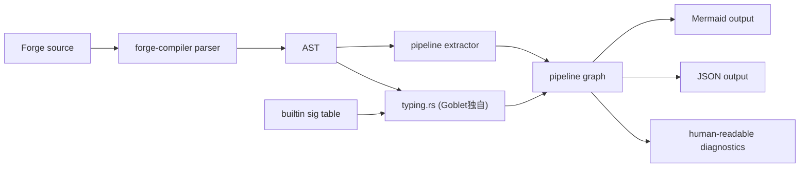
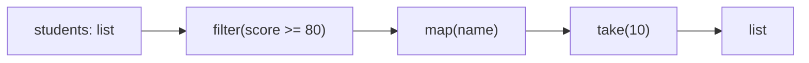
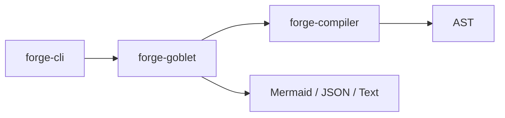

# Goblet 仕様
> 作成日: 2026-04-14
> 位置づけ: ForgeScript のデータパイプライン可視化・型整合性検証ツール
> ステータス: Draft

---

## 1. 概要

`goblet` は、ForgeScript で書かれたデータパイプラインを解析し、**DAG として可視化**し、各ステップの**入力型 / 出力型 / 型不整合 / 実行不能要因**を説明するデバッグツールである。

主な対象は以下のようなコードである。

```forge
let names =
    students
    |> filter(s => s.score >= 80)
    |> map(s => s.name)
    |> take(10)
```

Goblet はこの式を解析して、

- 各ステップを DAG ノードとして抽出する
- 各ノードの入力型と出力型を推定する
- 型エラーや未解決シンボルを該当ノードに紐づけて表示する
- Mermaid / JSON などの形式で出力する

ことを目的とする。

---

## 2. 背景

ForgeScript は現在、以下の 2 系統で処理される。

- `forge run` / `forge test`: AST を `forge-vm` が直接評価
- `forge build` / `forge transpile`: AST を `forge-transpiler` が Rust に変換

この構造では、デバッグの中核情報はバイトコードではなく **AST と型情報** にある。

そのため Goblet は VM の後段に割り込むのではなく、**`forge-compiler` の parser / AST / typechecker を基盤にした静的解析ツール**として設計する。

---

## 3. 目的

Goblet の目的は次の通り。

1. ForgeScript のパイプラインを視覚的に理解しやすくする
2. パイプラインが動かない原因を、コード位置つきで説明する
3. 各ステップの型整合性を検証し、壊れている箇所をノード単位で特定する
4. `forge check` の型エラーを、パイプライン文脈で読みやすく再表現する
5. 将来的に実行時トレースやサンプルデータ付きデバッグへ拡張する

---

## 4. 非目的

Goblet の初期フェーズでは以下は対象外とする。

- 汎用 CFG 可視化
- 関数本体全体の SSA 変換
- 最適化器
- 実行計画生成
- クエリコンパイラ
- 本格的な profiler
- 任意の Forge コード全体を完全に型推論すること

Goblet はまず **データパイプライン特化の静的デバッガ** として始める。

---

## 5. 想定ユースケース

### 5.1 型エラーの原因特定

```forge
let result =
    students
    |> map(s => s.score)
    |> map(s => s.name)
```

上記では 2 段目の `map` で `s` は `number` になっているため `.name` が不正である。Goblet は以下を出す。

- Step 1 出力型: `list<number>`
- Step 2 入力型: `number`
- エラー: field access `name` is invalid on `number`

### 5.2 `Option` / `Result` の流れ確認

```forge
let email =
    users
    |> find(u => u.id == target_id)
    |> map(u => u.email)
    |> unwrap_or("unknown")
```

Goblet は `list<User> -> User? -> string? -> string` という変換の流れを段ごとに表示する。

### 5.3 JSON 変換の説明

```forge
let output =
    raw_events
    |> map(e => { id: e.id, score: e.meta.score })
    |> filter(e => e.score >= 0)
```

Goblet は匿名 struct の導入と各ステップの出力型を示す。

---

## 6. 位置づけ

Goblet は新規パッケージではあるが、初期実装は **ForgeScript 製アプリ**ではなく、**Rust 実装の解析ツール**として始めるのが妥当である。

理由:

- `forge-compiler` の AST を直接使いたい
- `typechecker` の既存情報を再利用したい
- `forge-cli` に統合しやすい
- Mermaid / JSON 出力は CLI ツールに向く

最終的な構成は以下を想定する。

- 設計文書: `lang/packages/goblet/spec.md`
- 将来の実装候補: `crates/forge-goblet`
- CLI 統合候補: `forge goblet ...`

---

## 7. 対象となるパイプライン

初期フェーズで対象にする構文は以下。

- `|>` パイプライン
- `object.method(...)` の連鎖
- `map`, `filter`, `fold`, `find`, `partition`, `zip`, `take`, `skip`, `sort`, `group_by`
- `Option` / `Result` 系の `map`, `and_then`, `unwrap_or`, `or`, `filter`
- 匿名 struct を返す `map`

対象外:

- `await` を含む複雑な非同期制御
- ネストした `match` の全分岐 DAG 化
- 任意の再帰呼び出し展開
- マクロ的展開

---

## 8. 基本アーキテクチャ



Goblet は AST を 2 系統で処理する。

- 構造抽出: パイプライン式をノード列または DAG に落とす
- 型付与: 各ノードに入力型 / 出力型 / エラーを付ける

**重要:** `forge-compiler` の既存 typechecker は Goblet の要求に対して機能不足であるため、
Goblet は `typing.rs` に**独自の前向き型推論エンジン**を持つ必要がある。
詳細は §12 を参照。

---

## 9. モジュール構成案

`crates/forge-goblet` を作る場合、以下のような分割を推奨する。

### 9.1 `lib.rs`

- 公開 API
- `analyze_source`
- `render_mermaid`
- `render_json`

### 9.2 `graph.rs`

- Goblet 独自の中間表現を定義
- `PipelineGraph`
- `PipelineNode`
- `PipelineEdge`
- `NodeKind`
- `TypeSummary`
- `Diagnostic`

### 9.3 `extractor.rs`

- AST から pipeline を抽出
- `Expr::Pipe`
- method chain
- closure body の簡易解析

### 9.4 `typing.rs`

- 型チェッカの補助
- 各ノードの入出力型を推定
- 組み込みメソッドのシグネチャを管理

### 9.5 `diagnostics.rs`

- エラー整形
- ノード単位で「なぜ失敗したか」を自然文で生成

### 9.6 `render/mermaid.rs`

- Mermaid 出力
- ノード色分け
- エラー強調

### 9.7 `render/json.rs`

- JSON 出力
- UI や VS Code 拡張の入力にも使う

### 9.8 `cli.rs`

- `forge-cli` 統合時の引数解釈

---

## 10. 中間表現

Goblet は AST をそのまま表示せず、可視化向けの中間表現に変換する。

### 10.1 `PipelineGraph`

```rust
pub struct PipelineGraph {
    pub roots: Vec<NodeId>,
    pub nodes: Vec<PipelineNode>,
    pub edges: Vec<PipelineEdge>,
    pub diagnostics: Vec<Diagnostic>,
    pub source_file: Option<String>,
}
```

### 10.2 `PipelineNode`

```rust
pub struct PipelineNode {
    pub id: NodeId,
    pub label: String,
    pub kind: NodeKind,
    pub span: Option<SourceSpan>,
    pub input_type: Option<TypeSummary>,
    pub output_type: Option<TypeSummary>,
    pub status: NodeStatus,
    pub notes: Vec<String>,
}
```

### 10.3 `NodeKind`

候補:

- `Source`
- `PipeCall`
- `MethodCall`
- `FunctionCall`
- `Closure`
- `Literal`
- `FieldAccess`
- `Filter`
- `Map`
- `Fold`
- `Find`
- `Partition`
- `Zip`
- `OptionOp`
- `ResultOp`
- `Unknown`

### 10.4 `TypeSummary`

```rust
pub struct TypeSummary {
    pub display: String,
    pub nullable: bool,
    pub fallible: bool,
}
```

表示用途の要約型であり、`forge-compiler` の内部 `Type` をそのまま露出しない。

---

## 11. パイプライン抽出ルール

### 11.1 直線パイプライン

```forge
a |> f() |> g() |> h()
```

これは直線グラフとして扱う。

```text
a -> f -> g -> h
```

### 11.2 method chain

```forge
students.filter(...).map(...).take(10)
```

これも pipeline とみなし、method call を段として展開する。

### 11.3 クロージャ

```forge
students |> map(s => s.name)
```

`map` ノードに closure 概要を添付する。

- parameter type
- closure return type
- closure 内 field access

初期フェーズでは closure 内を独立サブグラフにするのではなく、`notes` として要約する。

### 11.4 分岐

```forge
xs |> map(x => if x > 0 { x } else { 0 })
```

初期フェーズでは 1 ノードの内部注記として扱う。完全な分岐 DAG にはしない。

---

## 12. 型解析方針

Goblet の核は「各段で型がどう変わるか」を示すことである。

### 12.0 既存 TypeChecker の制約

`crates/forge-compiler/src/typechecker/checker.rs` を調査した結果、現在の TypeChecker は
以下の式に対してすべて `Type::Unknown` を返すことが確認されている。

| 式の種類 | TypeChecker の返り値 |
|---------|---------------------|
| `Expr::Call { .. }` | `Type::Unknown` |
| `Expr::MethodCall { .. }` | `Type::Unknown` |
| `Expr::Pipeline { .. }` | `Type::Unknown` |
| `Expr::AnonStruct { .. }` | `Type::Unknown` (パターン未登録) |
| ユーザー定義 struct/enum | `Type::Unknown` |

正しく型を返すのは以下のみ。

| 機能 | 状態 |
|------|------|
| 基本リテラル (`number`/`string`/`bool`/`float`) | ✓ |
| `Option<T>` / `Result<T>` アノテーション | ✓ |
| `List<T>` アノテーション | ✓ |
| `match` の網羅性チェック (Option/Result のみ) | ✓ |

また、組み込みメソッド (`map`/`filter`/`find` 等) のシグネチャ表は TypeChecker に一切登録されていない。

**結論:** Goblet は既存 TypeChecker に型推論を委ねることができない。
`typing.rs` に**Goblet 独自の builtin シグネチャ表と前向き型推論ロジック**を実装する必要がある。

### 12.1 情報源

- `forge-compiler` の AST (パース結果のみ使用)
- ローカル変数の型アノテーション (`let x: list<User> = ...` など)
- **Goblet 独自の builtin シグネチャ表** (TypeChecker ではなく Goblet 側で管理)
- パイプライン内での前向き型伝播

### 12.2 最低限必要な型遷移

- `list<T>.map(fn(T)->U) -> list<U>`
- `list<T>.filter(fn(T)->bool) -> list<T>`
- `list<T>.find(fn(T)->bool) -> T?`
- `T?.map(fn(T)->U) -> U?`
- `T?.and_then(fn(T)->U?) -> U?`
- `T?.unwrap_or(U) -> T | U`
- `list<A>.zip(list<B>) -> list<(A, B)>`
- `list<T>.partition(fn(T)->bool) -> (list<T>, list<T>)`

### 12.3 エラー分類

- `UnknownSymbol`
- `UnknownMethod`
- `TypeMismatch`
- `InvalidFieldAccess`
- `InvalidClosureReturn`
- `UnsupportedPipelineShape`
- `InferenceFailed`

---

## 13. 診断の設計

Goblet はコンパイラエラーをそのまま出すのではなく、**パイプライン上の位置に再投影した説明**を出す。

例:

```text
Pipeline error at step 3: map(s => s.name)

input type:
  number

expected:
  a struct or record with field `name`

actual:
  number

reason:
  previous step changed the pipeline output to `list<number>`
```

診断には以下を含める。

- 失敗ステップ番号
- ソース位置
- ステップ名
- 入力型
- 期待型
- 実際の型
- 1 行サマリ
- 追加説明

---

## 14. 出力形式

### 14.1 Mermaid

README や PR コメント向け。



エラー時は `:::error` スタイル等を使う。

### 14.2 JSON

IDE や Web UI 連携向け。

```json
{
  "nodes": [
    {
      "id": "n2",
      "label": "map(s => s.name)",
      "input_type": "number",
      "output_type": null,
      "status": "error"
    }
  ]
}
```

### 14.3 Text

CLI の標準出力向け。

```text
[1] students                      input: list<Student>   output: list<Student>
[2] map(s => s.score)             input: Student         output: list<number>
[3] map(s => s.name)              input: number          error: invalid field access `name`
```

---

## 15. CLI 仕様案

Goblet は最終的に `forge-cli` に統合する。

### 15.1 コマンド案

```bash
forge goblet graph path/to/file.forge
forge goblet graph path/to/file.forge --format mermaid
forge goblet graph path/to/file.forge --format json
forge goblet explain path/to/file.forge
forge goblet explain path/to/file.forge --line 12 --column 18
```

### 15.2 サブコマンド

- `graph`: パイプラインを抽出して図を出す
- `explain`: エラーや型遷移を自然文で説明
- `dump`: 生の `PipelineGraph` を表示

### 15.3 オプション

- `--format text|json|mermaid`
- `--output <file>`
- `--line <n>`
- `--column <n>`
- `--function <name>`
- `--include-closures`

---

## 16. forge-cli 統合案



`forge-cli` 側の追加は最小限にする。

- 引数追加
- ファイル読み込み
- `forge_goblet::analyze_source(...)` 呼び出し
- 出力選択

---

## 17. IDE 連携案

Goblet は CLI だけでなく、将来的に以下へ展開できる。

- `forge-lsp`（Language Server Protocol サーバー）
- `forge-mcp`
- Web UI / VS Code Webview パネル

JSON 出力を安定化しておけば、IDE 側では

- DAG の描画
- ステップクリックで該当行へ移動
- 型エラーのホバー表示

が可能になる。

### 17.1 forge-lsp との統合

Goblet が G-3 (CLI) まで完成した後、`forge-lsp` を実装し統合する。

統合の核心は **`|>` 演算子へのホバー**である。
LSP の `textDocument/hover` リクエストでカーソル位置を受け取り、
Goblet の `PipelineGraph` と `SourceSpan` を使ってカーソルが属するノードを特定し、
パイプライン全体をマークダウンに整形してポップアップに表示する。

```
students
  |> filter(s => s.score >= 80)   list<Student> → list<Student>
▶ |> map(s => s.name)             Student → string        ← カーソルここ
  |> take(10)                     list<string> → list<string>
```

この機能が完成すると、ForgeScript は「パイプラインの型の流れを
書きながらその場で確認できる言語」になる。

詳細仕様は `lang/packages/lsp/spec.md` を参照。

### 17.2 HTML ビューア

> ステータス: 将来拡張（G-3 完成後）

Mermaid の静的 PNG 出力では以下が困難なため、インタラクティブな HTML ビューアを検討する。

- ノードをクリックして対応するソース行へジャンプ
- struct フィールドをホバーで展開表示
- エラー一覧 → クリックで該当ノードへ移動
- 複数パイプラインをタブ切り替えで比較

**実現方法の候補:**
- `render_html(graphs: &[PipelineGraph]) -> String` を追加し、Mermaid.js を CDN で読み込む1ファイル HTML を出力する
- `forge goblet graph <file> --format html --output pipeline.html` で生成
- 追加クレート不要（render/ 配下に `html.rs` を追加するだけ）

PNG/Mermaid 出力と目的が異なる（静的共有 vs インタラクティブ確認）ため、両方を残す設計が妥当。

---

## 18. 実行時トレース拡張

初期実装は静的解析中心だが、将来的にはサンプル入力を流して実行時の値も観測したい。

### 18.1 目標

- 各ステップでの値のサンプルを表示
- `filter` 後に要素数がどう変わったかを見る
- `find` が `none` になった箇所を示す
- `Result` が `err` に落ちた箇所を示す

### 18.2 実現方法

- `forge-vm` にトレースフックを追加
- パイプラインノード ID と実行時イベントを対応づける
- Goblet で静的 DAG と動的 trace をマージする

これは Phase 2 以降に回す。

---

## 19. 既存コードベースとの接続

Goblet が主に依存するのは以下。

- `crates/forge-compiler/src/ast/mod.rs`
- `crates/forge-compiler/src/parser/mod.rs`
- `crates/forge-compiler/src/typechecker/checker.rs`
- `crates/forge-cli/src/main.rs`

必要に応じて、

- pipeline 抽出に向いた AST ヘルパ
- typechecker の公開 API 整備
- builtin method signature の共通表

を追加する。

---

## 20. MVP

### 20.1 MVP 範囲

- 単一ファイル解析
- `|>` と method chain の抽出
- `list` / `Option` の主要メソッドの型追跡
- Mermaid / JSON / Text 出力
- 1 つのパイプラインに対するエラー説明

### 20.2 MVP で通したい例

#### 正常系

```forge
let names =
    students
    |> filter(s => s.score >= 80)
    |> map(s => s.name)
```

#### 異常系

```forge
let names =
    students
    |> map(s => s.score)
    |> map(s => s.name)
```

#### Option 系

```forge
let name =
    users
    |> find(u => u.id == id)
    |> map(u => u.name)
    |> unwrap_or("unknown")
```

---

## 21. フェーズ分割

### Phase G-0: 土台

- `crates/forge-goblet` 作成
- `PipelineGraph` 定義
- Mermaid / JSON / Text renderer 作成

### Phase G-1: 抽出

- `|>` 抽出
- method chain 抽出
- span 対応

### Phase G-2: 型 (Goblet 独自推論)

**注意:** 既存 TypeChecker は Pipeline/MethodCall/Call/AnonStruct に対して
`Type::Unknown` を返すため、以下はすべて Goblet が独自実装する。

- **builtin シグネチャ表の実装** (G-2 の最優先タスク)
  - `list<T>.map(fn(T)->U) -> list<U>`
  - `list<T>.filter(fn(T)->bool) -> list<T>`
  - `list<T>.find(fn(T)->bool) -> T?`
  - `list<T>.take(n) -> list<T>`, `skip`, `sort`, `fold`, `zip`, `group_by`, `partition`
  - `T?.map(fn(T)->U) -> U?`
  - `T?.and_then(fn(T)->U?) -> U?`
  - `T?.unwrap_or(U) -> T`
  - `T?.or(T?) -> T?`, `T?.filter(fn(T)->bool) -> T?`
  - `T?.is_some() -> bool`, `T?.is_none() -> bool`
- 前向き型伝播ロジック (`typing.rs` 実装)
- ローカル変数アノテーションからの型収集
- closure パラメータ型の推論 (入力型から T を抽出)
- エラー表現

### Phase G-3: CLI

- `forge goblet graph`
- `forge goblet explain`

### Phase G-4: 高度化

- closure 内要約
- 匿名 struct 表示
- module / use を跨ぐ解決

### Phase G-5: 実行時トレース

- VM trace
- 値の可視化

---

## 22. リスク

### 22.1 型推論不足 (既知・確定)

調査の結果、Forge の typechecker は Goblet の要求する粒度に**確実に**足りないことが判明した。

具体的には以下がすべて `Type::Unknown` を返す。

- `Expr::Call` (関数呼び出し)
- `Expr::MethodCall` (メソッド呼び出し)
- `Expr::Pipeline` (`|>` 式)
- `Expr::AnonStruct` (匿名 struct)
- ユーザー定義型全般

また組み込みメソッドのシグネチャ表が TypeChecker に存在しない。

対応 (確定):

- Goblet は既存 TypeChecker を**型推論エンジンとして使わない**
- `typing.rs` に Goblet 独自の builtin シグネチャ表を実装する
- パイプラインの型遷移は Goblet が前向きに自己推論する
- 推論できなかった箇所は `TypeSummary { display: "?", .. }` として表示し許容する
- 将来的に TypeChecker が強化されれば活用を検討するが、現時点では依存しない

### 22.2 パイプライン抽出の曖昧さ

method chain と通常 call の境界が曖昧な場合がある。

対応:

- まずは whitelist ベースで pipeline node を認識

### 22.3 closure の複雑化

closure 本体が大きいとノードの説明が破綻する。

対応:

- 初期版では closure は 1 行要約
- 深掘りは `--include-closures` 時のみ

---

## 23. 将来像

Goblet は最終的に以下の姿を目指せる。

- ForgeScript 用のデータフロー・デバッガ
- IDE 内で使える pipeline visualizer
- `forge check` の補助 explain ツール
- Anvil / Crucible / stdlib を含む実用コードの解析支援

特に ForgeScript が「データ変換を読みやすく書く」方向へ進むなら、Goblet は言語 UX を底上げする基盤になる。

---

## 24. 結論

Goblet は ForgeScript に対して実装価値が高い。

理由は以下。

- 現在のアーキテクチャが AST 中心であり、静的解析ツールを追加しやすい
- データパイプライン文脈での型エラー説明は需要が高い
- Mermaid / JSON 出力は README, PR, IDE, MCP に展開しやすい
- 初期は小さく作り、将来はトレースや IDE 連携へ育てられる

最初の着地点は、**単一ファイルの pipeline expression を抽出し、各ステップの型とエラーを出す Goblet MVP** である。
