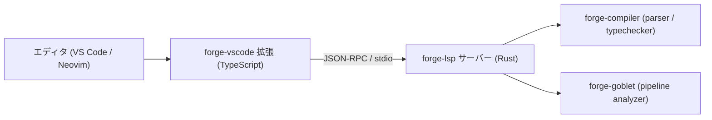

# `forge-lsp` 仕様
> 作成日: 2026-04-15
> 位置づけ: ForgeScript の Language Server Protocol 実装
> ステータス: Draft

---

## 1. 概要

`forge-lsp` は ForgeScript のための LSP (Language Server Protocol) サーバーである。

LSP に対応した任意のエディタ（VS Code / Neovim / Helix 等）から接続することで、
以下の機能を ForgeScript ファイルに対して提供する。

- **ホバー**: カーソル位置の型・シンボル情報・パイプライン展開の表示
- **診断**: パースエラー・型エラーのインライン表示
- **定義ジャンプ**: 関数・変数・struct の定義へ移動
- **補完**: メソッド・変数・キーワードの入力補完

特に `|>` パイプライン演算子の上にカーソルを合わせると、
**Goblet による解析結果**（各ステップの入力型・出力型・データ形状）が
ホバーポップアップに展開される。これが forge-lsp のキラー機能である。

---

## 2. 背景

ForgeScript は現在、`forge run` / `forge test` / `forge goblet` といった
CLI ツールのみを持つ。エディタ上でのリアルタイムフィードバックがなく、
型エラーはコマンド実行時にしか分からない。

LSP を実装することで、ForgeScript の開発体験を大幅に向上させることができる。

---

## 3. 目的

1. ForgeScript のパースエラー・型エラーを、コードを書きながらエディタ上で確認できる
2. `|>` パイプライン演算子にホバーすると、Goblet の解析結果が展開される
3. 関数・変数・struct への定義ジャンプができる
4. メソッドや変数の補完候補が出る
5. 将来的に VS Code 拡張として配布できる

---

## 4. 非目的

初期フェーズでは以下は対象外とする。

- フォーマッター (`forge fmt`)
- リファクタリング支援（rename symbol 等）
- コードアクション（quick fix）
- デバッガ統合 (DAP)
- Jupyter カーネル統合
- 複数ワークスペースの同時管理

---

## 5. アーキテクチャ



### 5.1 通信方式

- JSON-RPC over stdio（標準的な LSP 通信方式）
- サーバーはエディタ拡張から子プロセスとして起動される

### 5.2 クレート構成

| クレート | 内容 |
|---------|------|
| `crates/forge-lsp` | LSP サーバー本体 (Rust) |
| `editors/vscode/` | VS Code 拡張 (TypeScript) |

### 5.3 依存ライブラリ

- `tower-lsp`: Rust 製 LSP サーバーフレームワーク
- `tokio`: 非同期ランタイム（tower-lsp が要求）
- `forge-compiler`: パース・型チェック
- `forge-goblet`: パイプライン解析

---

## 6. LSP 機能一覧

### 6.1 `initialize`

- サポートする機能を `ServerCapabilities` で宣言
- `textDocumentSync`: Incremental
- `hoverProvider`: true
- `diagnosticsProvider`: true（push型）
- `definitionProvider`: true
- `completionProvider`: true（フェーズ L-4 以降）

### 6.2 `textDocument/didOpen` / `textDocument/didChange`

- ファイルの内容を受け取り、内部のドキュメントキャッシュを更新
- 変更のたびに非同期でパース・診断を走らせ、`textDocument/publishDiagnostics` を push する

### 6.3 `textDocument/hover`

カーソル位置に応じて以下を返す。

| カーソル位置 | ホバー内容 |
|-------------|-----------|
| `|>` 演算子 | Goblet によるパイプライン展開（各ステップの型・形状・状態） |
| 変数名 | 型アノテーションまたは推論型 |
| 関数名 | シグネチャ（引数・戻り値型） |
| struct フィールド | フィールドの型 |
| メソッド名 | メソッドシグネチャ |

`|>` ホバー時の表示例:

````markdown
**Pipeline: `names`**

```
[1] students          list<Student>   {id:number, name:string, score:number}
 ▶  filter(score>=80) list<Student>   MaybeEmpty
[3] map(s => s.name)  list<string>
[4] take(10)          list<string>
```
````

### 6.4 `textDocument/publishDiagnostics`

- `forge-compiler` のパースエラーを `Diagnostic` として push
- `forge-compiler` の型エラー（実装済み範囲）を push
- severity: Error / Warning / Information / Hint

### 6.5 `textDocument/definition`

- 変数・関数・struct の定義位置へジャンプ
- `use` 文で import された名前の解決
- 初期フェーズは同一ファイル内のみ対応

### 6.6 `textDocument/completion`

- `.` 入力後にメソッド候補を返す
- `|>` 入力後にパイプライン操作候補（`filter`, `map`, `find` 等）を返す
- ローカル変数・関数名の補完

---

## 7. `|>` ホバーの詳細設計

これが forge-lsp の中心機能であり、Goblet との統合点である。

### 7.1 処理フロー

```
1. hover リクエスト受信（行・列）
2. ドキュメントキャッシュから AST を取得
3. 行・列から該当 Expr を特定
4. Expr が Pipeline または Pipeline の一部かチェック
5. パイプライン全体を特定して forge-goblet に解析依頼
6. PipelineGraph を取得
7. カーソル位置のノードをハイライト（▶ マーカー）して markdown に整形
8. hover レスポンスとして返す
```

### 7.2 カーソル位置とノードの対応

`PipelineNode::span` の `line` / `col_start` / `col_end` を使い、
カーソルが属するノードを特定する。

パイプライン内の任意の `|>` にカーソルを合わせると、
**パイプライン全体が表示され、カーソル位置のステップが強調される**。

### 7.3 ホバー markdown の構造

```markdown
**Pipeline: `<バインド名>`**

```
[1] <source>          <type>   <shape>   <state>
 ▶  <current step>    <type>   <shape>   <state>   ← カーソル位置
[N] <next step>       <type>   <shape>
```

⚠ Step 3: `map(s => s.name)` — field `name` not found on `number`
```

エラーがない場合は診断セクションを省略する。

---

## 8. ドキュメントキャッシュ

LSP サーバーはファイルの内容を `HashMap<Url, DocumentState>` でキャッシュする。

```rust
struct DocumentState {
    text: String,
    version: i32,
    ast: Option<Vec<Stmt>>,          // パース済み AST
    pipeline_graphs: Vec<PipelineGraph>, // Goblet 解析結果
    diagnostics: Vec<Diagnostic>,
}
```

`didOpen` / `didChange` のたびに非同期で再パース・再解析し、
`publishDiagnostics` を push する。

ホバー時はキャッシュ済みの `ast` / `pipeline_graphs` を使うため、
ホバーごとに再パースは不要。

---

## 9. 診断の設計

`forge-compiler` のエラーを LSP `Diagnostic` に変換する。

```rust
fn to_lsp_diagnostic(err: &ForgeError) -> lsp_types::Diagnostic {
    lsp_types::Diagnostic {
        range: span_to_lsp_range(&err.span),
        severity: Some(DiagnosticSeverity::ERROR),
        message: err.message.clone(),
        source: Some("forge".to_string()),
        ..Default::default()
    }
}
```

将来的に Goblet の型診断（`UnknownMethod` / `TypeMismatch` 等）も
`DiagnosticSeverity::WARNING` として push する。

---

## 10. VS Code 拡張（`editors/vscode/`）

### 10.1 役割

- `forge-lsp` バイナリを子プロセスとして起動
- LSP クライアントとして JSON-RPC を中継
- `.forge` ファイルに言語設定を適用

### 10.2 構成

```
editors/vscode/
  package.json         — 拡張マニフェスト
  src/extension.ts     — エントリポイント
  src/client.ts        — LanguageClient 起動
  syntaxes/forge.tmLanguage.json  — シンタックスハイライト
```

### 10.3 `package.json` のポイント

```json
{
  "contributes": {
    "languages": [{ "id": "forge", "extensions": [".forge"] }],
    "grammars": [{ "language": "forge", "path": "./syntaxes/forge.tmLanguage.json" }]
  },
  "activationEvents": ["onLanguage:forge"]
}
```

### 10.4 シンタックスハイライト

TextMate Grammar (`forge.tmLanguage.json`) で以下を定義。

- キーワード: `let`, `fn`, `if`, `else`, `match`, `for`, `in`, `use`, `struct`, `enum`, `return`
- 演算子: `|>`, `=>`, `?`, `!`
- 型アノテーション: `:` 以降
- 文字列・数値リテラル
- コメント: `//`

---

## 11. 他エディタ対応

LSP は標準プロトコルであるため、VS Code 以外でも動作する。

| エディタ | 設定方法 |
|---------|---------|
| Neovim | `nvim-lspconfig` に `forge-lsp` を登録 |
| Helix | `languages.toml` に `forge` 言語を追加 |
| Zed | Zed Extensions API 経由 |

VS Code 拡張は最初のターゲット。他エディタはコミュニティ対応。

---

## 12. フェーズ分割

### Phase L-0: サーバー土台
- `crates/forge-lsp` クレート作成
- `tower-lsp` による LSP サーバー骨格
- `initialize` / `initialized` / `shutdown` ハンドラ
- stdio 通信の確認

### Phase L-1: 診断
- `didOpen` / `didChange` でパース実行
- パースエラーを `publishDiagnostics` で push
- VS Code で赤波線として表示される確認

### Phase L-2: ホバー（基本）
- 変数・関数・struct へのホバーで型情報を返す
- `textDocument/hover` ハンドラ実装

### Phase L-3: `|>` ホバー（Goblet 統合）
- `forge-goblet` を依存に追加
- `|>` 演算子上のホバーでパイプライン展開を表示
- カーソル位置のノードを `▶` でハイライト

### Phase L-4: 定義ジャンプ
- `textDocument/definition` 実装
- 同一ファイル内の関数・変数・struct 定義へジャンプ

### Phase L-5: 補完
- `textDocument/completion` 実装
- メソッド補完・変数補完・パイプライン操作補完

### Phase L-6: VS Code 拡張
- `editors/vscode/` 作成
- `forge-lsp` バイナリの同梱・起動
- シンタックスハイライト定義
- Marketplace への公開準備

---

## 13. リスク

### 13.1 Goblet 依存
`|>` ホバーは Goblet が完成していないと実装できない。
L-3 は Goblet G-3 (CLI) 完成後に着手する。
L-0〜L-2 は Goblet と独立して先行実装できる。

### 13.2 パフォーマンス
ファイル変更のたびに再パース・再解析が走る。
Goblet の解析は重くなりうるため、debounce（300ms 程度）を挟む。

### 13.3 非同期処理
tower-lsp は tokio 非同期ベース。
`forge-compiler` / `forge-goblet` の同期 API を `spawn_blocking` でラップする。

---

## 14. 将来像

- `forge check` の結果を LSP 診断に統合
- Goblet の型診断を Warning として push
- `forge goblet graph` の出力を VS Code の Webview パネルで表示
- rename symbol / find references
- インレイヒント（型推論結果をコードに重ねて表示）

---

## 15. 結論

`forge-lsp` は Goblet の完成後に着手する。

実装順序:
1. Goblet (G-0 〜 G-3) を完成させる
2. `forge-lsp` L-0〜L-2（診断・基本ホバー）を実装する
3. L-3 で Goblet を統合し `|>` ホバーを実装する
4. L-4〜L-6 で補完・定義ジャンプ・VS Code 拡張を整備する

LSP が完成すると、ForgeScript は「書きながら型を確認し、パイプラインの流れを
その場で可視化できる言語」になる。これは Goblet と LSP の組み合わせによる
ForgeScript の最大の UX 差別化点である。
